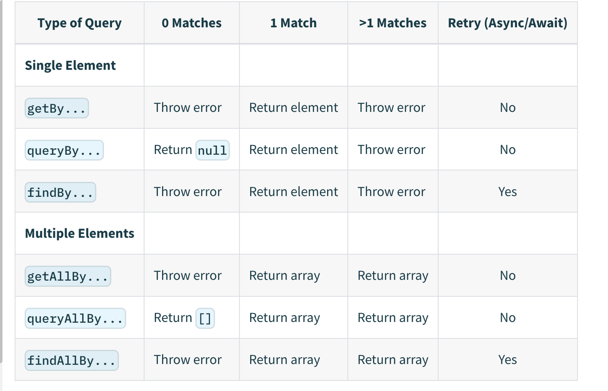
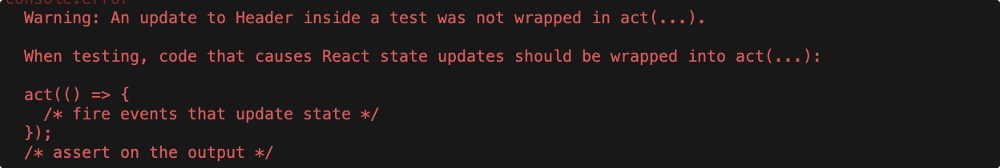
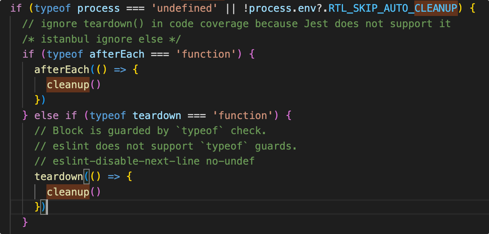

> The more your tests resemble the way your software is used, the more confidence they can give you.  
[您的测试越接近软件的使用方式，它们就越能给您带来信心。](https://twitter.com/kentcdodds/status/977018512689455106)
>


# 什么是testing-library?
在了解 `testing-library` 前，我们可以看看使用原生方法是如何进行 React 组件测试的。

```tsx
import Header from ".."
import client from 'react-dom/client'
import  { act } from 'react-dom/test-utils'

let container;
beforeEach(() => {
    container = document.createElement('div');
    document.body.appendChild(container)
});
afterEach(() => {
    document.body.removeChild(container);
    container = null;
})
test('test render', () => {
    act(() => {
        client.createRoot(container!).render(<Header />)
    });
    const button = container!.querySelector('button');
    const count = container!.querySelector("span[title='count']");

    act(() => {
        button?.dispatchEvent(new MouseEvent("click", { bubbles: true }));
        // or Simulate.click(button!)
    });
    expect(count?.textContent).toEqual('1')
})
```

在上面案例中，我们需要自行创建一个根容器来渲染 React 组件， 且我们必须及时清除该根容器，避免对其他测试用例产生影响。

在 Header 组件中，我们每次点击按钮都会进行计数+1，当我们要进行点击时，需要自行创建事件实例，且由于合成事件的原因需要增加 `bubbles` 属性，这使得对开发者也就有了些许能力要求。

除此之外，事件触发必须包裹在 `act` 方法中，`render` 方法中相同。


什么是 `act` ?

正常情况下，我们的单测代码是同步执行的，即代码执行完毕则单测完成。React 中的渲染并不是同步的，当我们进行事件触发，导致了 `rerender` 后，并不能立马获取新的页面结果，导致后续的断言失败。`act` 是由 React 官方在 `react-dom/test-utils` 中提供的一个方法，它能够让回调函数调用后，立即执行 React 内部 pending 中的异步队列。


我们再使用 `RTL` 去实现代码，`RTL` 为我们简化了 render 所需要的重复模板代码，模拟事件也不再需要包裹 `act` ，并提供了通用的查询方法。

```jsx
test('test by RTL', () => {
    const { getByRole, getByTitle } = render(<Header />);
    const button = getByRole("button")
    const count = getByTitle('count')
    fireEvent.click(button);
    expect(count.textContent).toEqual('1');
})
```


# 设计理念
testing-library 是`以用户为中心` 的方式进行UI组件的测试。什么是 `以用户为中心` ？

即以用户的角度方式去审视你的UI组件，用户是不关心你的组件内部是如何实现的，只关心最终的功能效果是否正确。你不应该在 testing-library 中去测试组件的 props 与内部 state，生命周期等是否正确。

Why ?

…


# 组成架构
testing-library的核心部分是 `DOM Testing Library` 即 `@testing-library/dom` , 它提供了通用的DOM查询功能，如`getByRole` `getByText`  与事件行为的基本实现。

在此基础上，再衍生出各自框架的专有包，如`React Testing Library` 、`Vue Testing Library` ，对于不同的前端框架，其使用方法是基本一致的, 提供不同实现方式的 `render` 与 `fireEvent` 方法。

除了每个前端框架提供各自的 `fireEvent` 接口外，还额外提供了一个`@testing-library/user-event`的通用包，不依赖于所选框架实现，它能够对用户事件的真实模拟，下文会详细说到。

除此之外，还针对 `Jest` 测试框架开发了一个断言库 `@testing-library/jest-dom` ，如我们平常经常使用的 `expect().toBeInTheDocument()` 就是该库为我们实现的，其通过 `jest` 提供的自定义断言器`expect.extend(matchers)` 将断言库注入到我们所使用的的 `jest` 上下文中


# 查询方法
查询作为`testing-library`的核心，它主要以用户的角度去查询，如根据组件展示的文字，Title等信息。

## 查询内容
从查询内容上来讲它提供了8种类型

1. ByRole  
通过可访问性、语义化查询元素, 如`checkbox`, `menu`, `navigation` , 对于实际场景并不常用。
2. ByLabelText  
通过label找到label所对应的元素，通常在表单中使用，如下

```jsx
render(
      <label>
        username
        <input />
      </label>
);
const el = screen.getByLabelText('username');
expect(el.tagName).toBe('INPUT')
```

3. ByPlaceHolder  
通过占位符查询元素，当查询表单元素等，但又没有label标识的话，可以使用这个，但不推荐。
4. ByText  
最常用的查询方法，根据 `textContent` 进行查询，通常可配合正则一起使用，如下

```jsx
render(<div>Text Content is: 1</div>);
const el = screen.getByText(/Text Content is/);
expect(el.textContent).toBe("Text Content is: 1");
```

5. ByDisplayValue  
通过数值进行查询包含该值的元素，如input与select会有value属性

```jsx
const {container} = render(
    <div>
    <select>
        <option value="state">state</option>
        <option value="prop">prop</option>
    </select>
    </div>
);
const select = container.querySelector('select')!;
select.value = 'state'
const el = screen.getByDisplayValue('state');
expect(el).toEqual(select)
```

6. ByAltText  
根据 `alt` 属性进行查询，如``
7. ByTitle  
根据 `title` 属性进行查询，同上
8. ByTestId  
如果以上查询方式都不容易查询到节点，则最终可以考虑testid，这种方式会侵入源代码，但不会对页面效果产生影响，通过在元素上添加 `data-testid` 属性来查询，查询时相当于`container.querySelector([data-testid="${yourId}"])`


有这么多方式，我该选哪个最好？

官方推荐优先使用用户页面可视的查询方式，如 `byRole`, `byText` 等可以在页面上看到的；其次是语义话查询方式，`byAltText` 与 `ByTitle` ，这是在页面上基本看不到，但是易于机器读懂的；最后才应该考虑`byTestId` 。如果 `byTestId` 也无法实现，那你只是使用原生的 `querySelector` 也没什么问题


## 查询方式
testing-library 一共提供了三种查询类型`getBy`、`findBy`、`queryBy` ，这三种类型定义了对查询结果的处理方式。

通过 `getBy` 方式查询, 当查询不到元素时会直接抛出一个错误, 则导致测试失败。

我们看看下面这个案例，上面部分额外的显式使用了断言，其运行结果最终是一模一样的。

但应该采用哪种写法最好？

```jsx
test("test getBy with assertion", () => {
    const { getByRole } = render(
        <div>
            <button>按钮</button>
        </div>
    );
    expect(getByRole("list")).toBeInTheDocument();
});

test("test getBy", () => {
    const { getByRole } = render(
        <div>
            <button>按钮</button>
        </div>
    );
    getByRole("list")
});
```

如果这段测试的意义是为了测试元素是否存在，则最佳实践应是采用使用显式断言的方式。

通过 `queryBy` 方式查询，与 `getBy` 的唯一不同就是查询不到元素时不会抛出错误。

那么什么情况下该使用 `queryBy` 还是 `findBy` ？

事实上，绝大多数情况下应直接使用 `getBy` ，只在想测试元素不存在这种场景时使用 `queryBy`

```jsx
test("test queryBy", () => {
    const { queryByRole } = render(
        <div>
            <button>按钮</button>
        </div>
    );
    expect(queryByRole("list")).not.toBeInTheDocument()
});
```

通过 `findBy` 进行查询，他与 `getBy`  一致，查询不到时会抛出错误，但是它能够用来查询异步元素。

何为异步元素？

在前面我们讲过，setState导致的异步渲染，我们已经通过React提供的 `act` 方法解决了，对于某些场景，比如上传文件后，显示已上传的文件列表，上传文件操作是异步的，我们需要在一定时间后才能拿到文件列表元素；又或者说 `setTimeout` 或者`promise` 中进行了`setState` 操作，渲染的元素也需要异步获取。

在讲 `findBy` 之前，我们先了解下 `waitFor` , `waitFor` 也是testing-library 提供的一个异步方法，

它提供了一种对于不确定代码运行时间的处理方法。在使用时，必须使单测块变为异步的，否则就没了使用意义，因此 `waitFor` 一般都与 `await` 一起使用。

使用方式如下：

```jsx
test("test waitFor", async () => {
    const Foo = () => {
        const [text, setText] = useState('text1')
        useEffect(() => {
            setTimeout(() => {
                setText('text2')
            }, 300);
        }, [])
        return <span>{text}</span>
    }

    const { getByText } = render(<Foo />);
    await waitFor(() => {
        expect(getByText('text2')).toBeInTheDocument()
    })
})
```

其原理也很简单，不断的去执行传入的回调函数，直到回调函数没有抛出错误或者超出最大等待时间。`expect` 断言失败，本质上也是抛出个错误, 因此一般会把断言写在 `waitFor` 中。

`waitFor` 默认超时时间为1000ms，每50ms执行一次回调。但在测试环境我们也不可能真去等1秒时间，其内部做了额外处理。

1. 默认会优先采用`jest`的 `fakeTimers` 来略过时间等待，但这个前提是在执行 `waitFor` 前，需要进行 `fakeTimers` 的注册，也就是执行 `jest.useFakeTimers()` 。  
但很多情况下我们是没有使用 `fakerTimers` , 且 testing-library 是测试框架无关的，所以在其他情况下会使用`MutationObserver` 来作为重复执行 `callback` 的时机。
2. 在循环开始前会添加一个超时时间的定时器 `overallTimeoutTimer` ，定时器回调被调用则说明超时，直接 `reject` 掉。
3. 当采用 `fakeTimers` 方案时，会在每次循环时通过 `jest.advanceTimersByTime` 等待一定的时间`interval` （并非真正的等待）
4. 在 `checkCallback` 方法中，会调用 `callback` ，并进行异常捕获，如捕获到异常则会进行下一次的循环，如果正常则在 `onDone` 方法中将 `finished` 置为 `true` ，并结束当前promise。
5. 当使用 `MutationObserver` 方案时，会监听 `document` DOM节点的变化（包括其自己节点）。除此之外，由于 `MutationObserver` 是监听`DOM树`来实现的，某些场景会有限制，如CSS属性的变化，因此还会启用一个 `setInterval` 原始的定时器来做辅助执行，保证回调一定会被执行。

```jsx
function waitFor(
  callback,
  {
    container = getDocument(),
    timeout = getConfig().asyncUtilTimeout,
    interval = 50,
    // 其他参数略
  },
) {
  return new Promise(async (resolve, reject) => {
    let lastError, intervalId, observer
    let finished = false
    let promiseStatus = 'idle'
		// 超时时间的timerid
    const overallTimeoutTimer = setTimeout(handleTimeout, timeout)
    const usingJestFakeTimers = jestFakeTimersAreEnabled()
    // 如果使用了jest的fakeTimers，则采用advanceTimersByTime快速略过时间
    if (usingJestFakeTimers) {
      const {unstable_advanceTimersWrapper: advanceTimersWrapper} = getConfig()
      checkCallback()
			// 不断的等待一定时间后并检测回调是否通过检测
      while (!finished) {
        await advanceTimersWrapper(async () => {
          jest.advanceTimersByTime(interval)
        })
				// 调用callback并检测是否跑错
        checkCallback()
        if (finished) {
          break
        }
      }
    } 
    // 如果没有使用fakeTimers，则退化为使用MutationObserver观测元素变化时执行一遍
    else {
      intervalId = setInterval(checkRealTimersCallback, interval)
      const {MutationObserver} = getWindowFromNode(container)
      observer = new MutationObserver(checkRealTimersCallback)
      observer.observe(container, mutationObserverOptions)
      checkCallback()
    }

		function checkCallback() {
      if (promiseStatus === 'pending') return
      try {
        const result = callback()
				// 处理callback为异步函数的情况
        if (typeof result?.then === 'function') {
          promiseStatus = 'pending'
          result.then(
            resolvedValue => {
              promiseStatus = 'resolved'
              onDone(null, resolvedValue)
            },
            rejectedValue => {
              promiseStatus = 'rejected'
              lastError = rejectedValue
            },
          )
        } else {
          onDone(null, result)
        }
      } catch (error) {
        lastError = error
      }
    }

    function onDone(error, result) {
      finished = true
      clearTimeout(overallTimeoutTimer)

      if (!usingJestFakeTimers) {
        clearInterval(intervalId)
        observer.disconnect()
      }

      if (error) {
        reject(error)
      } else {
        resolve(result)
      }
    }
}
```

从源码中看其实现还是很巧妙的，额外还需要注意的点是，回调函数是支持传入async函数的，当传入async函数时，会等待promise状态改变后才会再次执行。


再回到 `findBy` , 它其实就是对 `waitFor` 的一个封装，类似于下面这种代码。

```jsx
await waitFor(() => getByXXX())
```

在使用时也必须加上 `await` 关键字，并且当你想要使用 `findBy` 时，请确保元素最终一定会存在，如果你想要测试元素是否存在，请使用`waitFor + expect`的形式保证其具有足够的语义。

```jsx
test("test findBy", async () => {
    const Foo = () => {
        const [text, setText] = useState('text1')
        useEffect(() => {
            setTimeout(() => {
                setText('text2')
            }, 300);
        }, [])
        return <span>{text}</span>
    }

    const { findByText } = render(<Foo />);
    const span = await findByText('text2');
    expect(span.nodeName).toBe('SPAN')
})
```

除此之外，所有查询方法都是严格区分数量的，如果查询结果数量返回大于1，即使是 `queryBy` 类型，也会报错导致测试失败，对于多个返回的，需要使用`getAllBy`, `queryAllBy`, `findAllBy` 。

贴一张文档上的区别图



# 事件触发
testing-library提供了两种触发事件的方式，`fireEvent` 与 `userEvent`

## fireEvent
`fireEvent`是从React Testing LIbrary中引入的，其内部又是基于DOM Testing Library的  `fireEvent` 为 `React` 做了一些兼容性改动。

其使用方式非常方便, 有 `fireEvent(node, event)` 或者 `fireEvent(node, eventProperties)` 两种使用方式

```jsx
fireEvent.change(getByLabelText(/picture/i), {
  target: {
    files: [new File(['(⌐□_□)'], 'chucknorris.png', {type: 'image/png'})],
  },
});

fireEvent(getByLabelText(/picture/i), new Event('change', 
	{bubbles: true, cancelable: false})
);
```

在DOM Testing Library中 `fireEvent` 的实现, 也是通过 `dispatchEvent` 来做的

```jsx
function fireEvent(element, event) {
  return getConfig().eventWrapper(() => {
    if (!event) {
      throw new Error(
        `Unable to fire an event - please provide an event object.`,
      )
    }
    if (!element) {
      throw new Error(
        `Unable to fire a "${event.type}" event - please provide a DOM element.`,
      )
    }
    return element.dispatchEvent(event)
  })
}
```

那我们看看React Testing Library中又做了啥，它其实是对 `fireEvent` 加了层 `act` 包裹，这也是我们能直接使用的原因， `fireEvent` 时切记不要再手动包裹 `act` 了

```jsx
configureDTL({
  eventWrapper: cb => {
    let result
    act(() => {
      result = cb()
    })
    return result
  },
	// 略
})
```


我们实际开发中经常会时不时的遇到 `act` 的飘红报错，看到报错提示我们不经意间就加了个 `act`上去，但这样其实是没用的。




比如下面这个案例：

```jsx
test("test act warning", () => {
    const Foo = () => {
        const [text, setText] = useState('text1')
        useEffect(() => {
            Promise.resolve().then(() => setText('text2'))
        }, [])
        return <div>
                <span>{text}</span>
                <div>haha</div>
            </div>
    }

    const { getByText, debug } = render(<Foo />);
    const text = getByText('haha');
    expect(text).toBeInTheDocument()
    debug()
})
```

当我们代码中进行异步请求时，并在测试完成后或者 act 执行完成后，再在回调中进行 `setState` 则会导致报错。

上面这段代码想要修复报错，有很多方式，如可以在测试结束前进行等待来解决，或者直接干脆把异步请求的返回`mock`掉，不进行`setState` 。

优化后的代码

```jsx
test("test act warning", async () => {
    const Foo = () => {
        const [text, setText] = useState('text1')
        const fn = 
        useEffect(() => {
            Promise.resolve().then(() => setText('text2'))
        }, [])
        return <div>
                <span>{text}</span>
                <div>haha</div>
            </div>
    }

    const { getByText, findByText } = render(<Foo />);
    const text = getByText('haha');
    expect(text).toBeInTheDocument()
		// 等待后再结束测试
    await findByText('text2')
})
```

又或者使用异步的`act` , 在初次 `render` 时 手动包裹一层 `act` , `act` 是支持嵌套使用的。这在初始化组件时请求异步数据很有用

```jsx
await act(async () => render(<Foo />) )
const text = screen.getByText('text2');
expect(text).toBeInTheDocument()
```

如果我再加入个异步任务，结果又如何？

```tsx
useEffect(() => {
  Promise.resolve().then(() => setText('text2')).then(() => setText('text3'))
}, [])
```

答案是：tex3

## userEvent
`userEvent`是testing library的单独一个测试包，需要从`@testing-library/user-event`中引入。

与 `fireEvent` 不同的是，该包是完全以模拟用户的真实行为去触发事件的。

`fireEvent`是浏览器低级`dispatchEvent`API 的轻量级包装器，它允许开发人员触发任何元素上的任何事件。问题在于，浏览器通常不仅仅为一次交互触发一个事件。例如，当用户在文本框中键入内容时，必须聚焦该元素，然后触发键盘的输入事件。`userEvent` 其实就是真实模拟了用户使用时的交互方式。

下面是个简单的输入案例。

```jsx
test("test userEvent", async () => {
    const onChange = jest.fn();
    const onFocus = jest.fn();
    const onClick = jest.fn();
    const { getByPlaceholderText } = render(
        <input
            placeholder="请输入"
            type="textarea"
            onChange={onChange}
            onFocus={onFocus}
            onClick={onClick}
        />
    );
    const input = getByPlaceholderText("请输入");
    await userEvent.type(input, 'hello');
    expect(onChange).toHaveBeenCalled();
    expect(onFocus).toHaveBeenCalled();
    expect(onClick).toHaveBeenCalled();
    expect(input).toHaveDisplayValue('hello')
})
```

需要注意的是，`userEvent`由于模拟了一系列操作，需要以异步的形式调用才能获取结果。

`userEvent` 还提供了很多其他的模拟操作，如复制粘贴，模拟键盘打字，模拟文件上传等等用户交互场景。

值得注意的是，testing-library官方是推荐我们在大多数情况下应优先考虑使用 `userEvent` 而非 `fireEvent` 的，因为[您的测试越接近软件的使用方式，它们就越能给您带来信心。](https://twitter.com/kentcdodds/status/977018512689455106)


# 一些反模式
1. 不要再在无用的地方加 `cleanup` 了。  

首先为何需要有 `cleanup` 清除函数？  
在一个单测文件中我们可能有多个`test` ，每个测试实例渲染自己的组件，但是`window.document` 只有一个，每次 `render()` 都会往`body`下添加一个`div`作为根容器，我们保证测试自己的组件时 `body` 下是无子节点的避免影响。`cleanup` 会对当前所有挂载的React根组件进行`unmount`， 并移除对应的元素。

```jsx
function cleanup() {
  mountedRootEntries.forEach(({root, container}) => {
    act(() => {
      root.unmount()
    })
    if (container.parentNode === document.body) {
      document.body.removeChild(container)
    }
  })
  mountedRootEntries.length = 0
  mountedContainers.clear()
}
```

为何不需要再 `cleanup` 了？  
RTL中自动帮我们调了。

何时才需要 `cleanup` ？

同一个测试块中，`render` 了多次使其挂载了多个组件根节点, 也就是在`test`代码块内进行调用。  


1. 错误的使用 `waitFor`  
`waitFor` 中语句要有抛错的能力才有实际意义

```jsx
let el = null
await waitFor(() => {
    el = document.querySelector('.xxx')
})
```

```jsx
await waitFor(() => {
    fireEvent.click(el);
		expect(el).toBeDisabled();
})
```

3. 为`fireEvent` 包裹无意义的`act`

```jsx
// 错误的
act(() => {
	fireEvent.click(el)
})

// 可能正确的方式
await act(async () => {
	fireEvent.click(el)
})
```

tips: 更多的反模式参考[一些常见的RTL错误](https://kentcdodds.com/blog/common-mistakes-with-react-testing-library)


参考：

[https://www.robinwieruch.de/react-testing-library/](https://www.robinwieruch.de/react-testing-library/)

[https://testing-library.com/docs/queries/about#priority](https://testing-library.com/docs/queries/about#priority)


