## 什么是 KeepAlive?
用过Vue的童鞋都知道Vue官方自带了 `Keep-Alive` 组件，它能够使组件在切换时仍能保留原有的状态信息，并且有专门的生命周期方便去做额外的处理。该组件在很多场景非常有用，比如：

1. tabs 缓存页面
2. 分步表单
3. 路由缓存

我们先看看 Vue 中是如何使用的, 通过 `KeepAlive` 包裹内的组件自动就会缓存下来, 其中只能有一个直接子组件。

```jsx
<KeepAlive>
	// <component 语法相当于 React的{showA ? <A /> : <B />}
   <component :is="showA ? 'A' : 'B'">
</KeepAlive>
```

但可惜的是 React 官方目前并没有对外正式提供的 `KeepAlive` 组件，那我们可以参考 Vue 的使用方式与 API 设计，实现一套 React 版本的 `KeepAlive`。

## 实现方式
### 1. Style暴力隐藏法
这是最简单方便的方式，直接使用 `display: none` 来代替组件的销毁

封装一个 `StyleKeepAlive` 组件，传入的 `showComponentName` 属性表示当前要展示的组件名，同时 children 组件都需要定义下组件名 `name`。

```tsx
const StyleKeepAlive: React.FC<any> = ({children, showComponentName}) => {
    return (
        <>
            {React.Children.map(children, (child) => (
                <div
                    style={{
                        display: child.props.name === showComponentName ? "block" : "none",
                    }}
                >
                    {child}
                </div>
            ))}
        </>
    );
}

// 使用
<StyleKeepAlive showComponentName={counterName}>
      <Counter name="A" />
      <Counter name="B" />
</StyleKeepAlive>
```

假如就这样写，勉强能实现要求，但会带来以下问题

1. 第一次挂载时每个子组件都会渲染一遍。
2. 父组件 `render` ，会导致子组件 `render` ，即使该组件目前是隐藏状态。
3. 对实际 dom 结构具有侵入式，如会为每个子组件包一层 `div` 用来控制 `display` 样式。

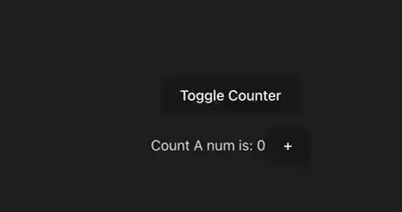

我们研究下antd的`Tabs` 组件，其 `TabPane` 也是通过 `display` 来控制显隐的, 动态设置`.ant-tabs-tabpane-hidden` 类来切换。

可是它并没有一次性就把所有 `TabPane` 渲染出来，`active` 过一次后再通过类名来做控制显隐，且切换 tab后，除了第一次挂载会 `render` ，后续切换 tab 都不会 `rerender` 。

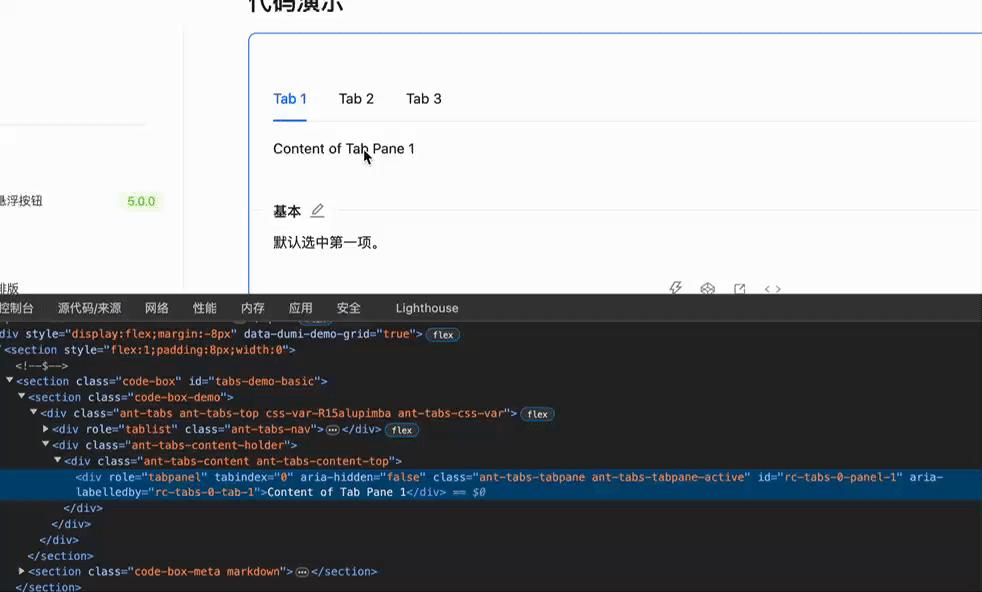

为了实现与 `Tabs` 一样的效果，我们稍加改造 `StyleKeepAlive` 组件, 对传入的 `children` 包裹一层 `ShouldRender` 组件，该组件实现初次挂载时只渲染当前激活的子组件, 且只有在组件激活时才会进行 `rerender` 。

```tsx
const ShouldRender = ({ children, visible }: any) => {
    // 是否已经挂载
    const renderedRef = useRef(false);
    // 缓存子组件，避免不必要的渲染
    const childRef = useRef();
    
    if (visible) {
        renderedRef.current = true;
        childRef.current = children();
    } 

    if (!renderedRef.current) return null;
    
    return (
        <div
            style={{
                display: visible ? "block" : "none",
            }}
        >
            {childRef.current}
        </div>
    );
};

const StyleKeepAlive: React.FC<any> = ({children, showComponentName}) => {
    return (
        <>
            {React.Children.map(children, (child) => {
                const visible = child.props.name === showComponentName;
                return (
                    <ShouldRender visible={visible}>
                       {() => child}
                    </ShouldRender>
                );
            })}
        </>
    );
}
```

那么再看看效果，我们实现了懒加载，但与antd 的 `Tabs` 不同的是， 父组件 `render` 时，我们对隐藏的子组件不会再进行 `render` , 这样能很大程度的减少性能影响。

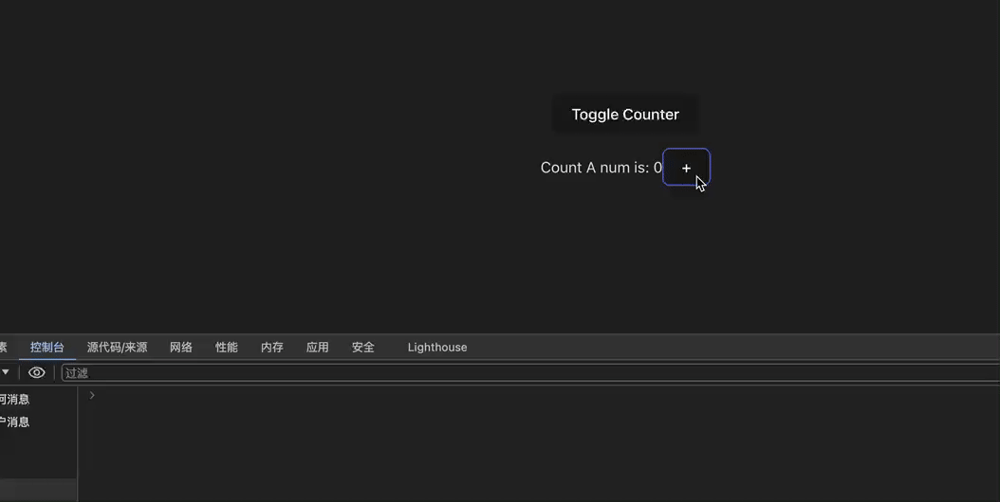

这种方式虽然通过很简易的代码就实现了我们需要的 `KeepAlive` 功能，但其仍需要保留 dom 元素，在某些大数据场景下可能存在性能问题，并且以下面这种使用方法，会使开发者感觉到它是一次性渲染所有子组件，没有 `isShow ? <A /> : <B />` 这样具有互斥的逻辑语义。

```tsx
<StyleKeepAlive showComponentName={componentName}>
      <Counter name="A" />
      <Counter name="B" />
</StyleKeepAlive>

// API可改写成这种形式更加直观, 且name也不再需要传
<StyleKeepAlive active={isActive}>
      <Counter />
</StyleKeepAlive>
<StyleKeepAlive active={isActive}>
      <Counter />
</StyleKeepAlive>
```


### 2. Suspense法
之前讲 `Suspense` 的文章，我们有提到过，`Suspense` 内部使用了 `OffScreen` 组件，这是一个类似于 `KeepAlive` 的组件，如下图所示，`Suspense` 的 `children` 会通过 `OffScreen` 包裹一层，因为 `fallback` 组件和 `children` 组件可能会多次进行切换。

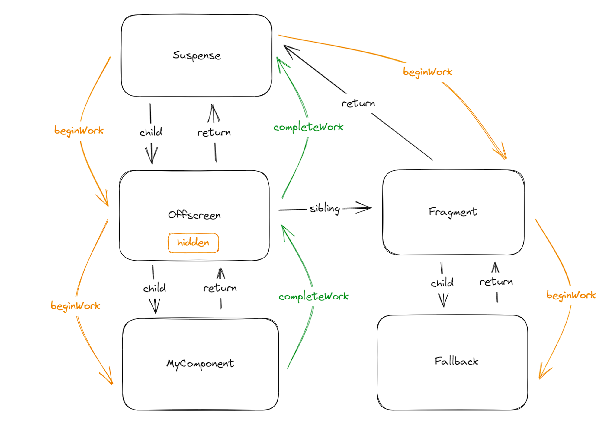

既然 `Offscreen` 可以看成 React 内部的 `KeepAlive` 组件，那我们下面深入研究下它的特性。

由于`Offscreen` 目前还是`unstable`状态，我们安装`试验性版本`的 react 和 react-dom 可以去尝试这个组件。

```tsx
pnpm add react@experimental react-dom@experimental
```

在组件中导入，注意：`Offscreen` 在今年某个版本后统一更名为了 `Activity` , 关联 [blog](https://react.dev/blog/2024/02/15/react-labs-what-we-have-been-working-on-february-2024#offscreen-renamed-to-activity) 。更名后其实更能体现出 `KeepAlive` 激活与失活的状态特性。

```tsx
import { unstable_Activity as Offscreen } from "react";
```

`Offscreen`组件的使用方式也很简单，只有一个参数 `mode: “visible” | ”hidden”`

```tsx
<Offscreen mode={counterName === "A" ? "visible" : "hidden"}>
    <Counter name="A" />
</Offscreen>
<Offscreen mode={counterName === "B" ? "visible" : "hidden"}>
    <Counter name="B" />
</Offscreen>
```

我们再看看实际的页面效果

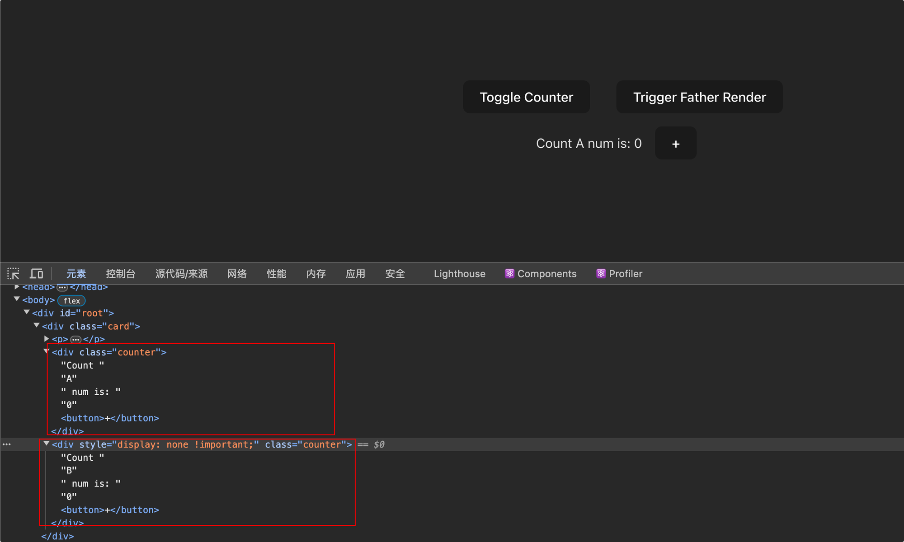

第一次组件挂载时，竟然把应该隐藏的组件也给渲染出来了，而且也是通过样式来控制显式隐藏的。

这乍眼看上去是不合理的，我们期望初次挂载时不要渲染失活的组件，否则类似于 `Tabs` 搭配数据请求的场景就不太适合了，我们不应该一次性请求所有 `Tabs` 中的数据。

但我们先别急，我们看看`useEffect`的执行情况，子组件中加入以下代码debug：

```tsx
console.log(`${name} rendered`)

useEffect(() => {
    console.log(`${name} mounted`)
    return () => {
        console.log(`${name} unmounted`)
    }
}, [])
```

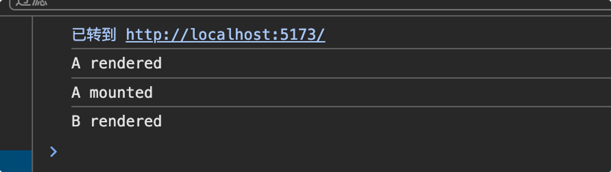

我们可以观察到，只有激活的`组件A`执行了 `useEffect` ，失活的`组件B`只是进行了一次`pre-render` 。

切换一次组件后，`A组件`卸载了，但是它最后又`render`了一次,  这是因为父组件中的 `counterName`更新了，导致子组件更新 。

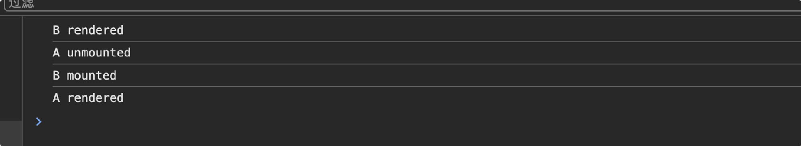

我们得出结论：

**通过 `Offscreen` 包裹的组件, `useEffect` 在每次激活时都会执行一次，且每次父组件更新都会导致其进行 `render`**

虽然激活才会调用 `useEffect` 的机制解决了副作用会全部执行的问题，但对失活组件的`pre-render` 是否会造成性能影响？

我们进行下性能测试，对比使用常规 `display `去实现的方法, 其中`LongList` 渲染20000条数据，且每条数据渲染依赖于参数 `value`,  `value` 为受控组件控制，那么当我们在父组件进行输入时，是否会有卡顿呢？

```tsx
const StyleKeepAliveNoPerf: React.FC<any> = ({children, showComponentName}) => {
    return (
        <>
            {React.Children.map(children, (child) => (
                <div
                    style={{
                        display: child.props.name === showComponentName ? "block" : "none",
                    }}
                >
                    {child}
                </div>
            ))}
        </>
    );
}

const LongList = ({value}: any) => {
    const [list] = useState(new Array(20000).fill(0))

    return (
        <ul style={{ height: 500, overflow: "auto" }}>
            {list.map((_, index) => (
                <li key={index}>{value}: {index}</li>
            ))}
        </ul>
    );
}

const PerformanceTest = () => {
    const [activeComponent, setActiveComponent] = useState('A');
    const [value, setValue] = useState('');

    return (
        <div className="card">
            <p>
                <button
                    onClick={() =>
                        setActiveComponent((val) => (val === "A" ? "B" : "A"))
                    }
                >
                    Toggle Counter
                </button>
            </p>
            <p>
                受控组件:
                <Input
                    value={value}
                    onChange={(e) => setValue(e.target.value)}
                />
            </p>
            <div>
                {/* 1. 直接使用display进行keep-alive */}
                <StyleKeepAliveNoPerf showComponentName={activeComponent}>
                    <Counter name="A" />
                    <LongList value={value} name="B" />
                </StyleKeepAliveNoPerf>

                {/* 2. 使用Offscreen */}
                <Offscreen mode={activeComponent === 'A' ? 'visible' : 'hidden'}>
                    <Counter name="A" />
                </Offscreen>
                <Offscreen mode={activeComponent === 'B' ? 'visible' : 'hidden'}>
                    <LongList value={value}/>
                </Offscreen>
            </div>
        </div>
    );
}
```

1. 使用 `StyleKeepAliveNoPerf`

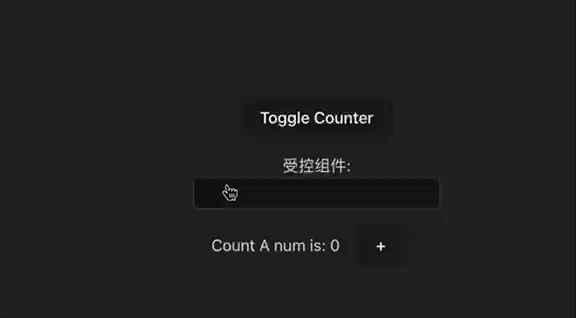

2. 使用`Offscreen`

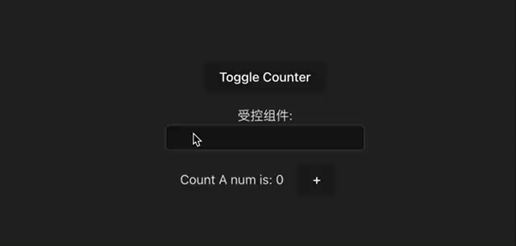

我们可以看到，使用`Offscreen` 下几乎没有任何性能影响，且查看dom树，即使失活的`LongList`组件也照样被渲染出来了。

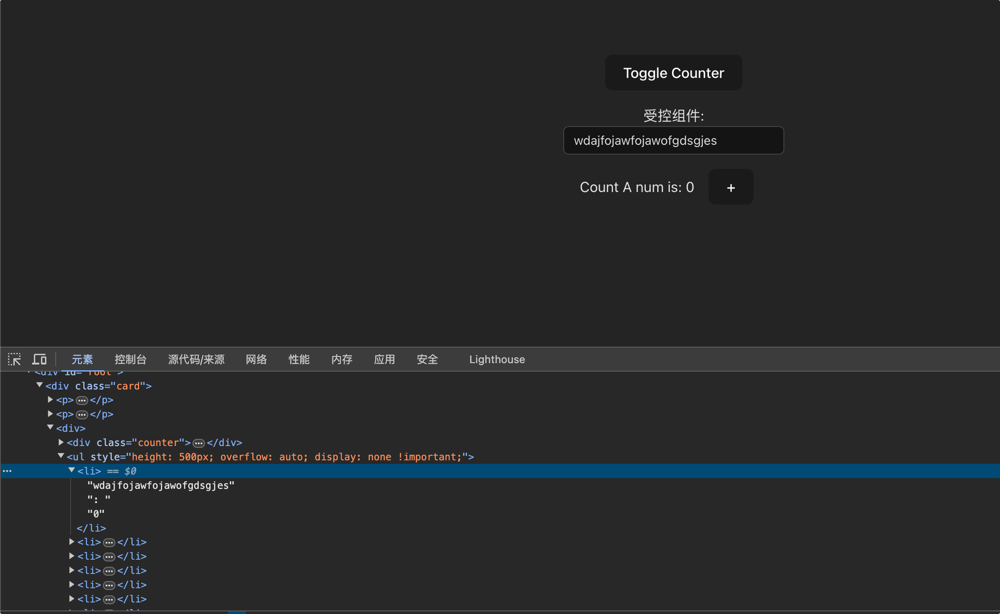

这样看来，使用 `Offscreen` 不但不会有性能影响，还有 `pre-render` 带来的某种意义上的性能提升。

这得益于React的 `concurrent` 模式，高优先级的组件会打断低优先级的组件的更新，用户输入事件拥有着最高的优先级，而 `Offscreen` 组件在`失活`时拥有着最低的优先级，如下为 `Lane` 模型中的优先级。

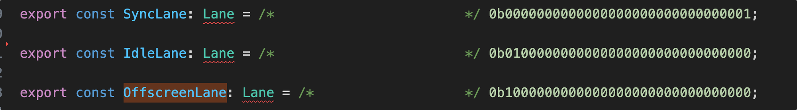

我们再与优化过的 `StyleKeepAlive` 组件比较，该组件对失活的组件不会进行 `render`，所以在进行输入时也非常流畅，但当我们切换组件渲染 `LongList` 时，出现了明细的卡顿掉帧，毕竟需要重新 render 一个长列表。而 `Offscreen` 在进行组件切换时就显得非常流畅了，只有 `dispaly` 改变时产生的`重排`导致的短暂卡顿感。

**也因此我们得出结论，使用 `Offscreen` 优于第一种 `Style` 方案。**
  
由于该组件还是 `unstable` 的，我们无法直接在项目中使用，所以我们需要利用已经正式发布的 `Suspense` 去实现 `Offscreen` 版的 `KeepAlive` 。

`Suspense` 需要让子组件内部 `throw` 一个 `Promise` 错误来进行 `children` 与 `fallback` 间切换，那么我们只需要在激活时渲染 `children` , 失活时 `throw Promise` ，就能快速的实现 `KeepAlive` 。

```tsx
const Wrapper = ({children, active}: any) => {
    const resolveRef = useRef();

    if (active) {
        resolveRef.current && resolveRef.current();
        resolveRef.current = null;
    } else {
        throw new Promise((resolve) => {
           resolveRef.current = resolve;
        })
    }

    return children;
}

const OffscreenKeepAlive = ({children, active}: any) => {
    return <Suspense>
        <Wrapper active={active}>
            {children}
        </Wrapper>
    </Suspense>
}
```

我们看看实际效果

初次渲染情况：

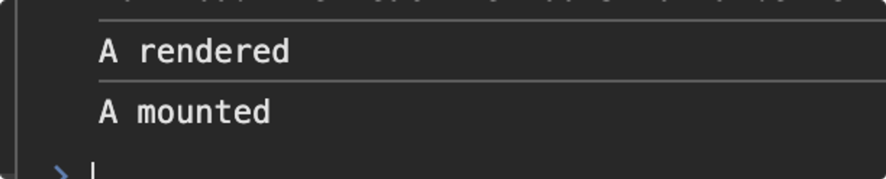

切换组件后渲染情况：

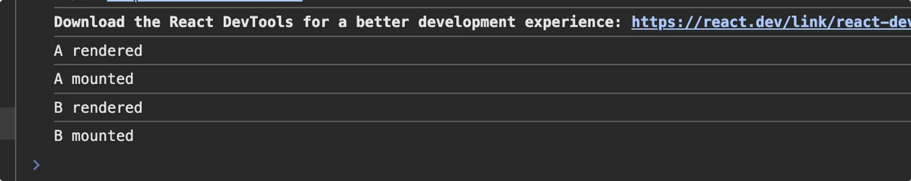

这与直接使用 `Offscreen` 的效果并不一致

1. 初次渲染只会渲染当前激活的组件，这是因为 `Suspense` 会在 `render` 时就抛出错误，那么当然不能把未激活的组件也 `render` 了。
2. 切换组件后，`A组件`的 `useEffect` 没有触发`unmount` , 也就是说，进行激活状态切换不会再去重新执行 `useEffect`。
3. 切换组件后，`A组件`失活，但没有进行`render` ，也就是说不会对失活的组件再进行渲染，也就是说没有了 `pre-render` 的特性

这样一来，虽然实现了 `KeepAlive` 功能，能够实现与我们的 `StyleKeepAlive` 完全一致的效果，但丢失了 `Offscreen` 激活/失活的生命周期，`pre-render` 预渲染等优点。

接下来，我们为其添加生命周期，由于失活的组件会直接被 `throw` 出去，子组件中的 `useEffect` 卸载函数不会被执行，我们需要把两个生命周期函数 `useActiveEffect`、`useDeactiveEffect` 中的回调注册给上层组件才能实现， 通过 `context` 传递注册函数。

```tsx
const KeepAliveContext = React.createContext<{
    registerActiveEffect: (effectCallback) => void;
    registerDeactiveEffect: (effectCallback) => void;
}>({
    registerActiveEffect: () => void 0,
    registerDeactiveEffect: () => void 0,
});

export const useActiveEffect = (callback) => {
  const { registerActiveEffect } = useContext(KeepAliveContext);

  useEffect(() => {
    registerActiveEffect?.(callback);
  }, []);
};

export const useDeactiveEffect = (callback) => {
  const { registerDeactiveEffect } = useContext(KeepAliveContext);

  useEffect(() => {
    registerDeactiveEffect?.(callback);
  }, []);
};
```

我们在上层组件 `KeepAlive` 中对 `effects` 进行保存，并监听 `active` 状态的变化，以执行对应的生命周期函数。

```tsx
const KeepAlive: React.FC<KeepAliveProps> = ({ active, children }) => {
  const activeEffects = useRef([]);
  const deactiveEffects = useRef([]);

  const registerActiveEffect = (callback) => {
    activeEffects.current.push(() => {
      callback();
    });
  };

  const registerDeactiveEffect = (callback) => {
    deactiveEffects.current.push(() => {
      callback();
    });
  };

  useEffect(() => {
    if (active) {
      activeEffects.current.forEach((effect) => {
        effect();
      });
    } else {
      deactiveEffects.current.forEach((effect) => {
        effect();
      });
    }
  }, [active]);

  return (
    <KeepAliveContext.Provider value={{ registerActiveEffect, registerDeactiveEffect }}>
      <Suspense fallback={null}>
        <Wrapper active={active}>{children}</Wrapper>
      </Suspense>
    </KeepAliveContext.Provider>
  );
};
```

至此，我们实现了一个相对比较完美的基于 `Suspense` 的 `KeepAlive` 组件。


### 3. DOM移动法
由于组件的状态保存的一个前提是该组件必须存在于`React组件树`中，也就是说必须把这个组件 `render` 出来，但 `render` 并不是意味着这个组件会存在于DOM树中，如 `createPortal` 能把某个组件渲染到任意一个DOM节点上，甚至是内存中的DOM节点。

那么要实现 KeepAlive，我们可以让这个组件一直存在于 React 组件树中，但不让其存在于 DOM树中。

社区中两个KeepAlive实现使用最多的库都使用了该方法，`react-keep-alive`, `react-activation` ，下面以 `react-activation` 最简单实现为例。完整实现见[react-activation](https://github.com/CJY0208/react-activation/)

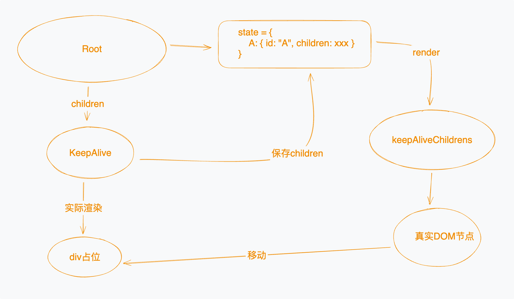

具体实现：

1. 在某个不会被销毁的父组件（比如根组件）上创建一个 `state` 用来保存所有需要 KeepAlive 的 `children`  ，并通过 `id` 标识
2. `KeepAlive` 组件会在首次挂载时将 `children` 传递给父组件
3.  父组件接收到 `children`，保存至 `state` 触发重新渲染，在父组件渲染所有KeepAlive `children`, 得到真实DOM节点，将DOM节点移动至实际需要渲染的位置。
4. `KeepAlive` 组件失活时，组件销毁，DOM节点也销毁，但 `children` 是保存在父组件渲染的，所以状态得以保存。
5. `KeepAlive` 再次激活时，父组件拿到缓存的 children，重新渲染一编，完成状态切换。

```tsx
import { Component, createContext } from 'react'

const KeepAliveContext = createContext({});

const withScope = WrappedComponent => props => (
  <KeepAliveContext.Consumer>{keep => <WrappedComponent {...props} keep={keep} />}</KeepAliveContext.Consumer>
)

export class AliveScope extends Component<any> {
  nodes = {};
  state = {};

  keep = (id, children) => {
    return new Promise((resolve) =>
      this.setState(
        {
          [id]: { id, children },
        },
        () => resolve(this.nodes[id])
      )
    );
  };

  render() {
    return (
      <KeepAliveContext.Provider value={this.keep}>
        {this.props.children}
        <div className='keepers-store'>
          {Object.values(this.state).map(({ id, children }: any) => (
        <div
          key={id}
          ref={(node) => {
            this.nodes[id] = node;
          }}
          >
          {children}
        </div>
      ))}
        </div>

      </KeepAliveContext.Provider>
    );
  }
}

class ActivationKeepAlive extends Component {
  constructor(props) {
    super(props)
  }

  placeholder: HTMLElement | null = null;

  componentDidMount(): void {
    this.init(this.props)
  }

  init = async ({ id, children, keep }) => {
    // keep用于向父组件传递最新的children,并返回该children对应的DOM节点
    const realContent = await keep(id, children)
    // appendChild为剪切操作
    this.placeholder?.appendChild(realContent)
  }
  
  // 只渲染占位元素，不渲染children
  render() {
    return (
      <div
        className='keep-placeholder'
        ref={node => {
          this.placeholder = node
        }}
        />
    )
  }
}

export default withScope(ActivationKeepAlive)

  // 使用
<AliveScope>
  {counterName === "A" && (
    <ActivationKeepAlive id="A">
      <Counter name="A" />
    </ActivationKeepAlive>
  )}
  {counterName === "B" && (
  <ActivationKeepAlive id="B">
    <Counter name="B" />
  </ActivationKeepAlive>
  )}
</AliveScope>
```

组件树如下，渲染在了 `AliveScope` 下，而非 `ActivationKeepAlive` 下


虽然这种方法理论性可行，但实际上会有很多事情要处理，比如事件流会乱掉，父组件更新渲染也会有问题，因为children 实际渲染在 `AliveScope` 上, 要让 `AliveScope` 重新渲染才会使 children 重新渲染。

在 `react-activation` 中，也还有部分问题有待解决，如果使用 `createPortal` 方案，也只是 `AliveScope` 中免去了移动 DOM 的操作（隐藏时渲染在空标签下，显示时渲染在占位节点下）。


以上所有demo代码，见[https://stackblitz.com/~/github.com/JackWang032/react-keep-alive-demo](https://stackblitz.com/~/github.com/JackWang032/react-keep-alive-demo)


参考

[https://v3.ice.work/docs/guide/advanced/keep-alive#缓存路由组件](https://v3.ice.work/docs/guide/advanced/keep-alive#%E7%BC%93%E5%AD%98%E8%B7%AF%E7%94%B1%E7%BB%84%E4%BB%B6)

[https://react.dev/blog/2023/03/22/react-labs-what-we-have-been-working-on-march-2023](https://react.dev/blog/2023/03/22/react-labs-what-we-have-been-working-on-march-2023)

[https://github.com/StructureBuilder/react-keep-alive](https://github.com/StructureBuilder/react-keep-alive)

[https://github.com/CJY0208/react-activation/](https://github.com/CJY0208/react-activation/)

